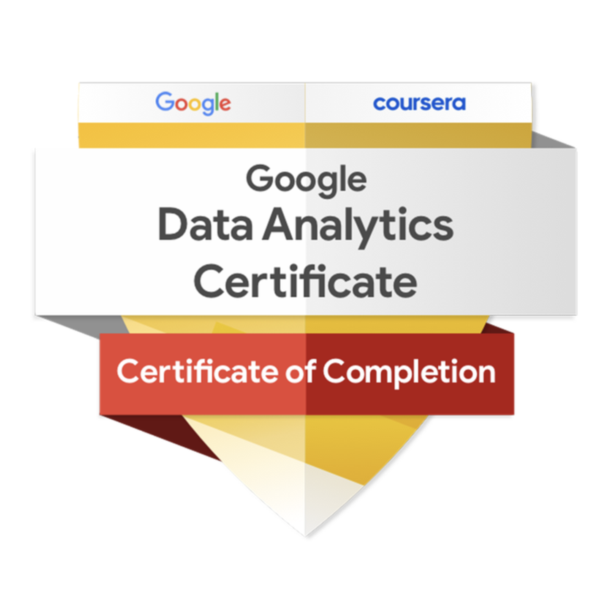
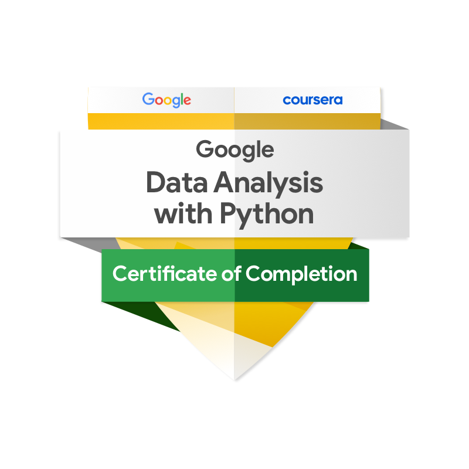

<h1>👋 Hi, I’m Fareed Ologundudu</h1>

  <strong>Python Data Analyst | Operations & Business Analytics (Remote)</strong>

  I help teams identify and fix <strong>operational inefficiencies</strong> by analyzing messy, real-world data and translating it into
  <strong>clear decisions managers can act on immediately</strong>. 
  Experience across <strong>Logistics, Sales Operations, Healthcare, and Backend Analytics</strong>.

  🔗 <strong>Live Portfolio:</strong> <a href="https://fareed04.pythonanywhere.com/" target="_blank">https://fareed04.pythonanywhere.com/</a>

---

## ⚡ What I Actually Do

* Identify where operational processes break (delivery delays, no-shows, revenue leakage)
* Analyze large, imperfect datasets using Python and SQL
* Isolate the small set of issues causing most failures using 80/20 analysis
* Deliver clearly documented insights that reduce management overhead in remote teams

---

## 🚀 Selected Work

### 📦 Logistics Performance Analysis

Identified a **double loss** where late deliveries increased freight costs by **12 percent** and dropped customer satisfaction to **2.56 out of 5**.  
Focused on São Paulo and Rio de Janeiro hubs to surface targeted, actionable operational fixes.  
🔗 https://github.com/Fareed04/logistics-performance-analysis

---

### 🚴 Cyclistic Bike-Share Behavioral Analysis

Analyzed **5.3M+ ride records** using Python to differentiate usage patterns between casual riders and annual members.

Identified key **behavioral markers** such as a 63% longer average ride duration for casual users to drive data backed membership conversion strategies.

🔗 https://github.com/Fareed04/Case_Study__Cyclistic_bike_share_analysis

---

### 🏥 Medical Appointment No-Show Prediction

Analyzed **110k+ medical appointments** to identify drivers of patient absenteeism and built a **cost-sensitive ML model** to reduce missed appointments and operational waste.  
Focused on feature behavior, model evaluation trade-offs, and decision impact for healthcare operations.  
🔗 https://github.com/Fareed04/medical-appointment-no-shows-analysis

---

### 🛒 Sales and Revenue Performance Analysis

Analyzed **over 2.2 million dollars** in sales data to identify **Technology and Phones** as primary revenue drivers and highlight underperforming segments.  
🔗 https://github.com/Fareed04/sales-performance-analysis

---

### ♟️ Chess.com Performance Analysis

Analyzed 3,254 rated games across Bullet, Blitz, and Rapid to identify opening strengths and weaknesses, track rating progression, and generate targeted improvement recommendations.
Identified the Scandinavian Defense (853 games, 48.8% win rate) and Queens Gambit as Black (39.5% win rate) as the most critical openings to study, with Kings Fianchetto as the weakest on both sides at 61.15% accuracy.

🔗 https://github.com/Fareed04/Chess-data-analysis

---

### 🏥 Healthcare Translation System

Built a real-time speech to text translation system using a **Python and Django backend**, demonstrating applied ML in a production style workflow.  
🔗 https://github.com/Fareed04/healthcare_translation_project

---

## 🛠️ Tech Stack

  

**Analytics and Data**  
Python • SQL • Pandas • NumPy • Matplotlib • Seaborn • Scikit Learn (applied)

**Backend and Data Access**  
Django • Flask • REST APIs • PostgreSQL • MySQL • SQLite

**Workflow and Delivery**  
Git • GitHub • Jupyter • VS Code • PyCharm • Postman • Vercel

---

## 📜 Certifications

<table>
  <!-- First Certificate -->
  <tr>
    <td width="120" valign="top" align="center">
      
    </td>
    <td valign="top">
      <strong>Google Data Analytics Professional Certificate</strong> 
      <em>Issued by Google / Coursera</em> 
      A rigorous, hands-on program covering the entire data analysis process: asking questions, preparing, processing, analyzing, sharing, and acting on data using spreadsheets, SQL, R, and Tableau.  
      <a href="https://coursera.org/share/250613b58974c255cf86759cd2486c9f">View Credential</a>
    </td>
  </tr>
  
  <!-- Second Certificate -->
  <tr>
    <td width="120" valign="top" align="center">
      
    </td>
    <td valign="top">
      <strong>Google Data Analysis with Python Specialization</strong> 
      <em>Issued by Google / Coursera</em> 
      An advanced, code-centric program focused on leveraging Python for the complete data science lifecycle. Developed expertise in data manipulation with Pandas and NumPy, exploratory data analysis (EDA), and data visualization with Matplotlib and Seaborn to uncover actionable insights.  
      <a href="https://coursera.org/share/fdf1c72fa905e9605512436f7794d844">View Credential</a>
    </td>
  </tr>
</table>

---

## 🎮 Beyond Work

* ♟️ Chess player applying strategic thinking and pattern recognition to analytical problem solving
* I enjoy building systems that are both **useful** and **well designed**

<picture>
  <source media="(prefers-color-scheme: dark)" srcset="https://raw.githubusercontent.com/Fareed04/Fareed04/output/pacman-contribution-graph-dark.svg">
  <source media="(prefers-color-scheme: light)" srcset="https://raw.githubusercontent.com/Fareed04/Fareed04/output/pacman-contribution-graph.svg">
  
</picture>

---

## 📬 Connect

* LinkedIn: https://linkedin.com/in/fareed-ologundudu-129506249  
* GitHub: https://github.com/Fareed04  
* Email: ologundudufareed@gmail.com
